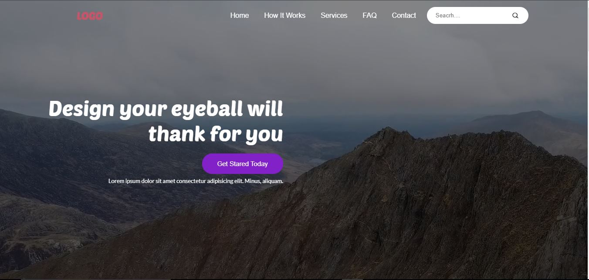

# Design Your Dreams

This project is a responsive and visually appealing multi-section website designed for creative agencies or businesses. Built using HTML, CSS, and JavaScript, it provides an engaging user experience with the following features:

## Dynamic Hero Section:
Features a video background, compelling tagline, and a call-to-action button to capture attention.

## Navigation Bar:
Includes links to major sections, a search bar, and a mobile-friendly hamburger menu.

## How It Works Section:
Placeholder for showcasing workflows or processes in an organized layout.

## Services Section:
Highlights offerings through descriptive text, images, and call-to-action buttons, presented in an aesthetically pleasing manner.

## FAQ Section:
A structured area to address frequently asked questions.

## Contact Section:
Includes a user-friendly contact form and essential business contact details (email, phone, and location).

## Footer:
Displays copyright information, privacy policies, and links to terms and FAQs.
